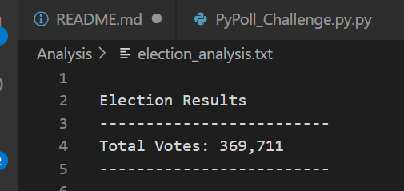

# Pypoll_Python_Challenge

*****
*****

* By: Patrick Ekanga
* September-October 2020
* Data Visualizations

*****
*****

## Overview of Election Audit

We were previoulsy tasked to go through the data set and determine the candidate winner of the congressional election.
We did that and visualize theresults. Now, ultimately, it was important to determine the county vote and related votes and assign the largest county winner and its votes. That's the main purpose of the current task whch Tom requested support and discuss the same information with the Colorado Board of Elections.

In this project, our final Python script will need to be able to deliver the following information upon when its run: 
  - Total number of votes cast
  - A complete list of candidates who received votes
  - Total number of votes each candidate received
  - Percentage of votes each candidate won
  - The winner of the election based on popular vote

## Election-Audit Results:

Below are the results of the audit detailed with related graphics.

- Total votes casted in the congressional election.
369,711 votes were casted in the three counties as mentionned in the table below.

- Breakdown of the number of votes and the percentage of total votes for each county in the precinct.
  
The table below visualizes the total votes per county and related percentage.

- Largest County with the number of votes

Denver was the largest county in terms of numer of votes with 306,055 voters.

- Number of votes and the percentage of the total votes per candidates.

As provided below.

- The winner and related vote count plus the percentage of the total votes.

The winner was Diana Degette with 73.8% of the total votes. The table below captures all the details.

## Election-Audit Summary: 

The final script can be utlized for all sorts of elections provided basics modificatiosn are made on the intended outcomes. The election commission could add addional inputs such as number of abstention, votes per county at the national level, demographic of the voters and gendrs of candidates.

